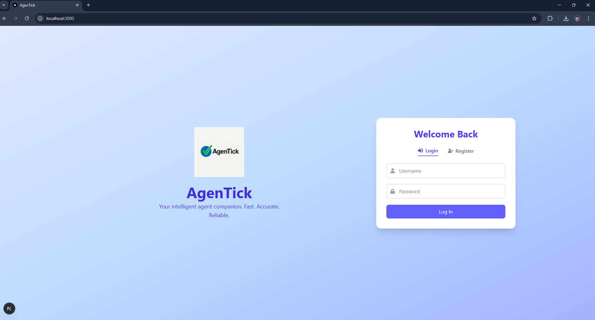

# Real Time Chat with Agentic Flow

## Overview
Real Time Chat with Agentic Flow is a modern chat application featuring a real-time conversation interface powered by an agentic backend. Both Frontend and Backend are designed for easy development, local testing, and Dockerized deployment.

## Clone from GitHub
```bash
git clone https://github.com/yourusername/yourrepo.git
cd yourrepo
```

## Directory Structure
```
/project-root
├── backend          # FastAPI backend
└── frontend         # Next.js frontend
```

## Run Locally

### Backend (FastAPI)
```bash
cd backend
pip install -r requirements.txt
uvicorn main:app --reload --host 0.0.0.0 --port 8000
```

### Frontend (Next.js)
```bash
cd frontend
npm install
npm run dev
```

## Run with Docker and Docker Compose
```bash
docker-compose up --build
```
This will start both the FastAPI backend and Next.js frontend in Docker containers.

## Screenshots

Below are interface screenshots to give you a visual sense of the app.

<div align="center">
  <table>
    <tr>
      <td></td>
      <td></td>
    </tr>
    <tr>
      <td></td>
      <td></td>
    </tr>
    <tr>
      <td></td>
      <td></td>
    </tr>
    <tr>
      <td></td>
      <td></td>
    </tr>
  </table>
</div>